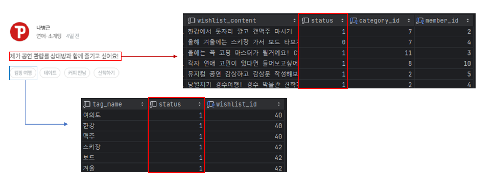
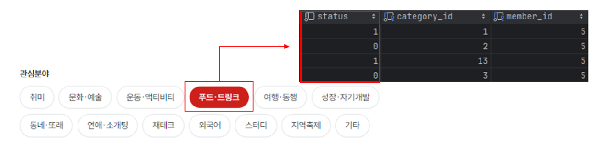
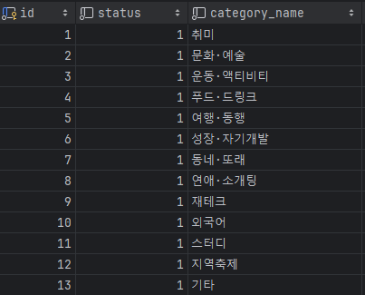
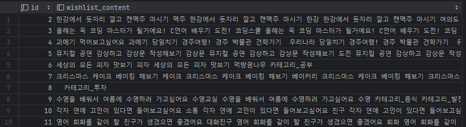
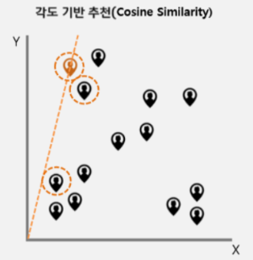
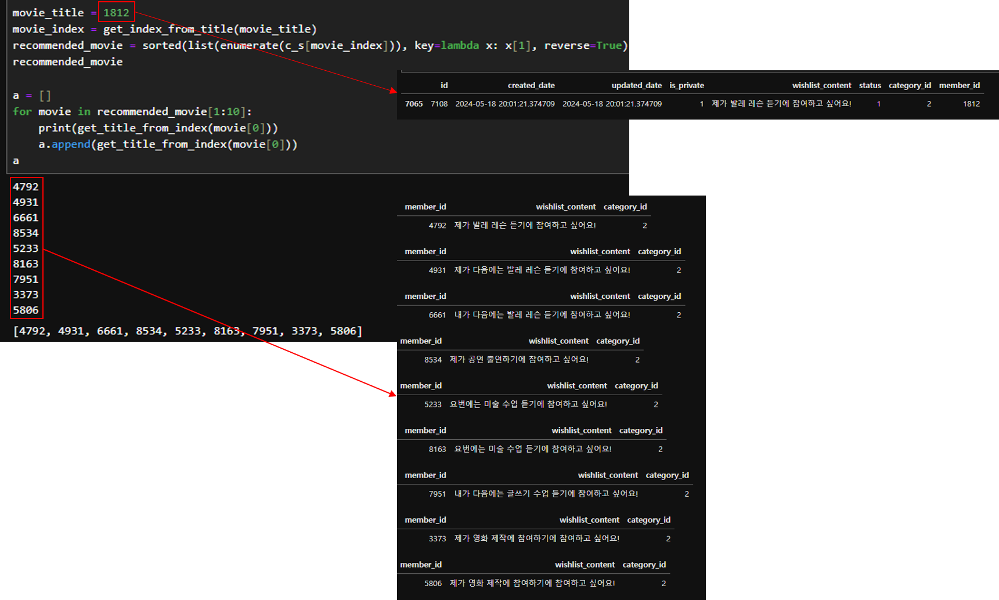
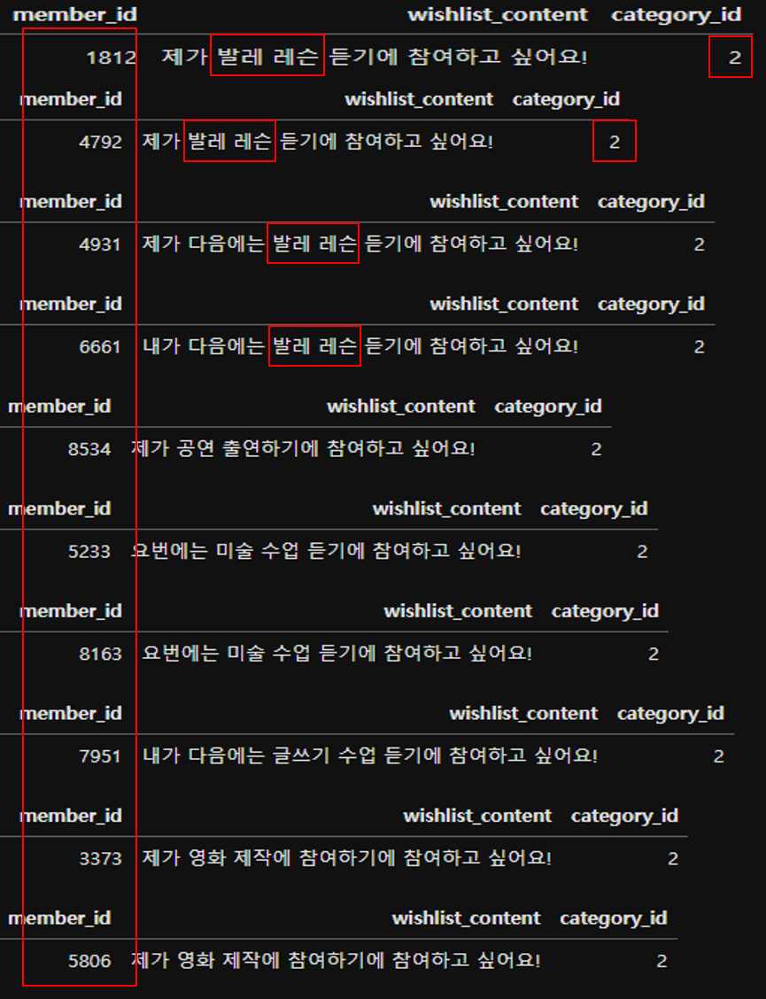
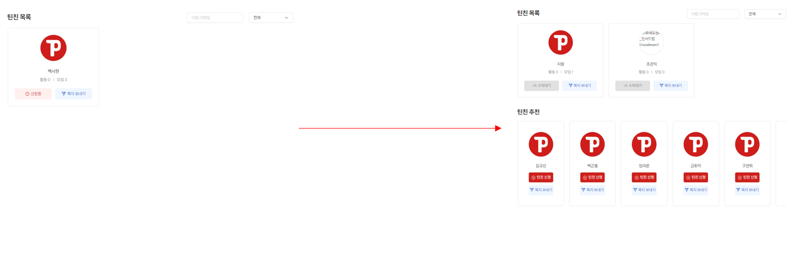
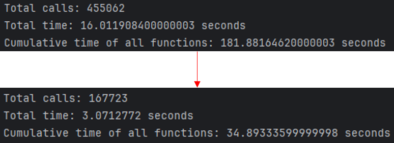

### teenplay ai project

##### teenchin 추천 시스템

---

### 기획 배경

서비스 이용 빈도가 낮은 사용자들에게 함께 활동할 수 있는 유저를 추천함으로써, 더 활발하게 참여할 수 있는 환경을 제공합니다. '문화를 함께 즐긴다'는 슬로건 아래, 유사한 관심사를 가진 사람들을 연결하여 공동 활동을 촉진합니다. 이를 통해 사용자들이 더 자주 서비스를 이용하고, 즐거움을 느낄 수 있도록 도와줍니다.

### 기대 효과

위시리스트 작성과 개인 선호 카테고리 선택을 유도함으로써, 사용자들이 좋아하는 활동을 더 많이 노출시킬 수 있습니다. 이를 통해 사용자 참여를 촉진하고, 서비스에 대한 만족도를 높일 수 있습니다. 사용자들은 자신이 선호하는 활동을 더 자주 접하며, 유사한 관심사를 가진 사람들과의 교류를 통해 더욱 풍부한 경험을 즐길 수 있습니다.

---

### 프로젝트

#### 데이터 수집

-   기본적으로 틴친추천 서비스는 개인의 관심 카테고리, 본인이 작성한 위시리스트와 태그를 기반으로 추천하기 때문에
    유저들이 직접 작성한 _member_favorite_category_, _wishlist_, _wishlist_tag_ 테이블을 사용합니다.




-   각 테이블 별로 status가 1은 활성화 0은 비활성화 상태입니다.
    status가 1 즉, 활성화 상태인 데이터만 사용합니다.

-   3개의 테이블을 member_id를 기준으로 group_by를 사용하여 묶어주고 **cosine similarity**를 사용하기 위해 하나의 피쳐로 만들어줍니다.



각 피쳐별있는 카테고리는 따로 테이블을 만들어 fk를 받아서 사용하였습니다. 각 number는 각각 의미하는 문자로 변형시켜줍니다.

-   각 피쳐들중 사용하기 _wishlit_content_,*tag_name*을 붙여서 하나의 피쳐로 만들어줍니다.

<details>
  <summary>Create View Code</summary>

```sql
CREATE OR REPLACE VIEW member_wishlist_view AS
SELECT
    m.id AS id,
    CONCAT(
        GROUP_CONCAT(DISTINCT CONCAT(IFNULL(w.wishlist_content, ''), ' ', IFNULL(wt.tag_name, '')) ORDER BY w.wishlist_content SEPARATOR ' '),
        ' ',
        GROUP_CONCAT(DISTINCT
            CASE
                WHEN c.id = 1 THEN '카테고리_취미'
                WHEN c.id = 2 THEN '카테고리_문화'
                WHEN c.id = 3 THEN '카테고리_액티비티'
                WHEN c.id = 4 THEN '카테고리_음식'
                WHEN c.id = 5 THEN '카테고리_여행'
                WHEN c.id = 6 THEN '카테고리_발전'
                WHEN c.id = 7 THEN '카테고리_동네모임'
                WHEN c.id = 8 THEN '카테고리_데이트'
                WHEN c.id = 9 THEN '카테고리_투자'
                WHEN c.id = 10 THEN '카테고리_언어'
                WHEN c.id = 11 THEN '카테고리_공부'
                WHEN c.id = 12 THEN '카테고리_축제'
                WHEN c.id = 13 THEN '카테고리_기타'
                ELSE ''
            END
            ORDER BY c.id SEPARATOR ' ')
    ) AS wishlist_content
FROM
    tbl_member m
LEFT JOIN
    tbl_member_favorite_category mfc ON m.id = mfc.member_id AND mfc.status = 1
LEFT JOIN
    tbl_category c ON mfc.category_id = c.id
LEFT JOIN
    tbl_wishlist w ON m.id = w.member_id AND w.status = 1
LEFT JOIN
    tbl_wishlist_tag wt ON w.id = wt.wishlist_id AND wt.status = 1
GROUP BY
    m.id;
```

</details>



-   이렇게 완성된 view를 df로 만들어 주고 **cosine similarity**를 진행합니다.

<details>
  <summary>Change DataFrame Code</summary>

```python
def get_member_wishlist_data():
    with connection.cursor() as cursor:
        cursor.execute("SELECT id, wishlist_content FROM member_wishlist_view")
        rows = cursor.fetchall()

    # 가져온 데이터를 데이터프레임으로 변환하고 열 이름을 명시적으로 변경
    df = pd.DataFrame(rows, columns=['id', 'wishlist_content'])

    return df

```

</details>

-   먼저 **CountVectorizer**란
    텍스트 문서에서 단어의 빈도를 세어줍니다. 등장하는 단어들을 세어서 백터(숫자 배열)로 만들어주어 문장의 단어가 몇 번 등장했는지 나타냅니다.

-   **cosine similarity**란



-   코사인 유사도(Cosine Similarity)는 두 벡터 사이의 유사도를 측정하는 방법 중 하나입니다. 이는 두 벡터가 이루는 각도의 코사인을 사용하여 유사도를 계산합니다. 코사인 유사도는 -1에서 1 사이의 값을 가지며, 값이 1에 가까울수록 두 벡터는 더 유사하고, 0이면 두 벡터는 서로 직교하며, -1에 가까울수록 두 벡터는 반대 방향을 가리킵니다.

<details>
  <summary>member_id_target Code</summary>

```python
class member_id_target():
    def member_id_target(self, member_target_number):

        data = get_member_wishlist_data()
        result_df = data.wishlist_content

        from sklearn.feature_extraction.text import CountVectorizer
        from sklearn.metrics.pairwise import cosine_similarity

        count_v = CountVectorizer()
        count_metrix = count_v.fit_transform(result_df)


        c_s = cosine_similarity(count_metrix)

        def get_index_from_title(member_id):
            return data[data.id == member_id].index[0]

        def get_title_from_index(index):
            return data[data.index == index]['id'].values[0]

        movie_title = member_target_number
        movie_index = get_index_from_title(movie_title)
        recommended_movie = sorted(list(enumerate(c_s[movie_index])), key=lambda x: x[1], reverse=True)

        target_member = []
        for movie in recommended_movie[1:30]:
            target_member.append(get_title_from_index(movie[0]))

        return target_member
```

</details>

### 검증



-   검증용으로 member_id를 입력하고 상위 9개를 뽑아봅니다.



-   모든 category_id는 같은것을 확인할 수 있으며 상위 4개는 같은 활동을
    희망하는 것을 볼 수 있다.

### 실제 데이터 추출

-   실제 데이터중 친구추가 관련 활동 경력이 없는 유저를 구분하여 화면에 나타날 9명을 추출한다.

<details>
<summary>Click data preprocessing</summary>

```python
    def get_unmatched_senders(self, member_id):
        results = member_id_target().member_id_target(member_id)
        friends_filter = Q(sender_id__in=results, receiver_id=member_id) | Q(sender_id=member_id,receiver_id__in=results)
        friend_ids = set(friend['sender_id'] for friend in friends).union(
            set(friend['receiver_id'] for friend in friends))
        unmatched_senders = [sender_id for sender_id in results if sender_id not in friend_ids]
        return unmatched_senders

    def get_teenchin_add(self, unmatched_senders):
        return list(Member.objects.filter(id__in=unmatched_senders).values('id', 'member_nickname'))

    def get(self, request, member_id, page):
        member_id = request.session.get('member').get('id')
        status_letter = request.GET.get('status_teenchin')
        search_text = request.GET.get('search', '')[:-1]
        row_count = 9
        offset = (page - 1) * row_count
        limit = page * row_count

        unmatched_senders = self.get_unmatched_senders(member_id)
        teenchin_add = self.get_teenchin_add(unmatched_senders)

        response_data = {
            'teenchin': teenchin[offset:limit],
            'teenchin_add': teenchin_add[:9]
        }

        return Response(response_data)
```

</details>

-   유저의 친추정보 밑에 추천친구를 나타내면서 유저들에게 정보를 제공한다.



---

### 트러블 슈팅

#### 문제점

-   코드가 복잡하고 최적화가 되어있지 않아 실행 시 서버가 폭파되는 현상이 지속적으로 발생

#### cProfile을 통해 성능검사를 진행 및 코드개선

-   검색로직 단순화, 반복코드 통합, 중복코드 제거
    

```
total_calls: 총 함수 호출 수를 출력합니다.
total_time: 전체 실행 시간을 출력합니다.
cumulative_time: 모든 함수의 누적 실행 시간을 더한 값을 출력합니다.
```



---

### 느낀점

-   서비스를 제공하기 위해서는 많은 데이터가 필요하고
    유저들로 하여금 데이터를 입력하고 자신의 활동을 유도해야 한다느
    것을 느꼇으며 유저가 직접 입력한 데이터는 매우 가치가 높다고
    생각했습니다.
-   모델을 구현하는 것도 중요하지만 코스트를 생각하며 만들어 사용할 수 있게 만드는 것이 더 중요하다.
